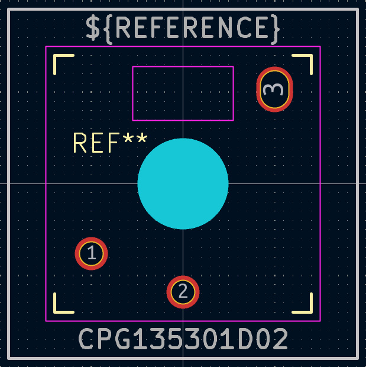
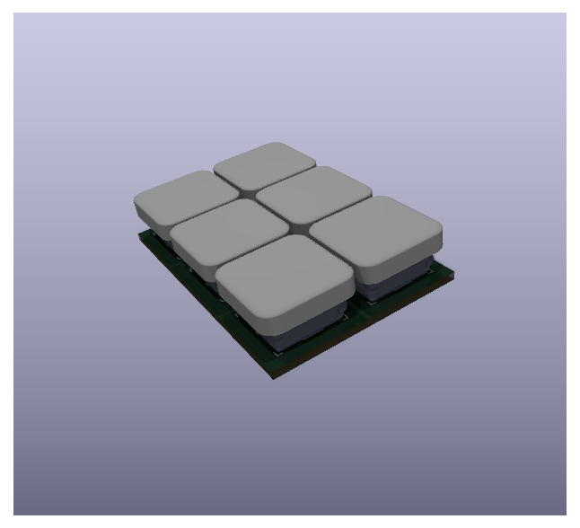

# May 24th: The basic layout and is done.

After deciding on using Kailh Choc V2 switches, I designed a split keyboard similar to the [Voyager](https://www.zsa.io/voyager) keyboard from ZSA.
Using [KLE](https://keyboard-layout-editor.com) I placed keys according to my own preference and semi-applied the [Graphite](https://github.com/rdavison/graphite-layout) layout. I made some changes to fit my use case, being mostly programming with Neovim and some gaming.
The design will allow me to start working on the schematic and place the keys automatically on the PCB.

**Total time spent: 3h**

# June 6th: The scheming can begin!

I opened Kicad with the intention of drawing a schematic when I realized that I am missing a footprint for the Kailh Choc V2 switches.
I then went on a wild goose chase trying to find resources or existing footprints that I can apply to my project.
The result of that search was the realization and decision that it would be easier to create my own footprint using the [datasheet](https://www.lcsc.com/datasheet/lcsc_datasheet_2411261541_Kailh-CPG135301D02_C5142796.pdf) available at LCSC.
The process was a very meaningful learning experience, as I always used available footprints. I had to figure out the meaning of different layers and settings using DuckDuckGo.

Another thing that was missing was a model that would allow me to roughly see how the final result would look like. I found a switch model [on GrabCAD](https://grabcad.com/library/kailh-low-profile-mechanical-keyboard-switch-pg1353-1) and a generic keycap model [on TinkerCad](https://www.tinkercad.com/things/eYS9n6hJxzm-cherry-mx-low-profile-keycap) which I converted to a step file using a generic file type conversion website.
The result was very satisfying to look at.

**Total time spent: 6h**
