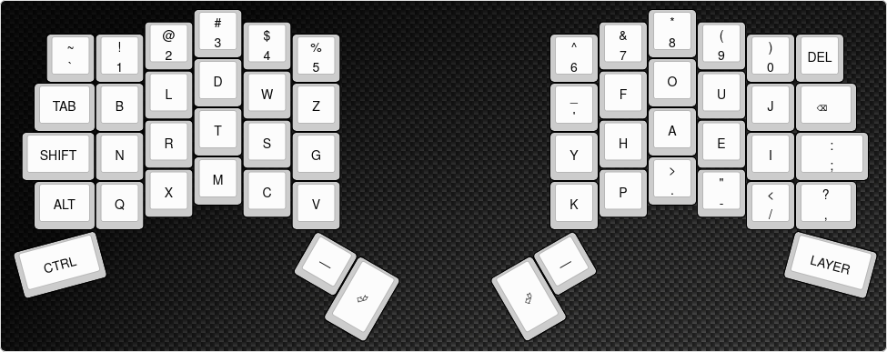

# May 24th: The basic layout and is done.

After deciding on using Kailh Choc V2 switches, I designed a split keyboard similar to the [Voyager](https://www.zsa.io/voyager) keyboard from ZSA.
Using [KLE](https://keyboard-layout-editor.com) I placed keys according to my own preference and semi-applied the [Graphite](https://github.com/rdavison/graphite-layout) layout. I made some changes to fit my use case, being mostly programming with Neovim and some gaming.
The design will allow me to start working on the schematic and place the keys automatically on the PCB.

**Total time spent: 3h**
